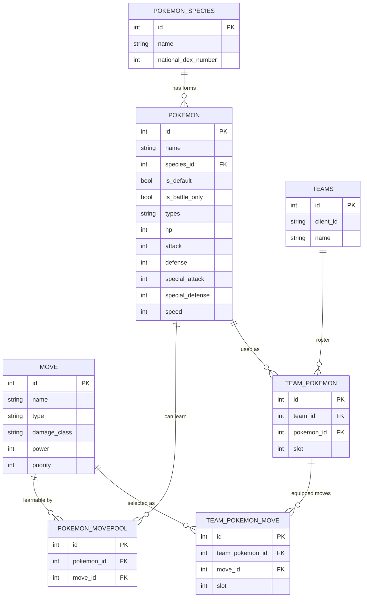

# Pokétactics

**Live app: [poketactics.app](https://poketactics.app/)**

An end-to-end Pokémon team builder: browse the full Pokédex, build and manage
multiple teams, generate a matchup-aware counter team for any roster, and get
alerted when a Pokémon on one of your teams changes in the underlying data.
React/Vite frontend, FastAPI backend, Postgres, PokeAPI as the data source.

## Contents

- [Stack](#stack)
- [Data model](#data-model)
- [Design decisions worth calling out](#design-decisions-worth-calling-out)
- [The counter-team generator is a deliberately simplified model](#the-counter-team-generator-is-a-deliberately-simplified-model--not-a-battle-simulator)
- [Future feature plans](#future-feature-plans)

## Stack

| Layer | Choice | Why |
|---|---|---|
| Frontend | React + Vite | Static build, fast dev loop, no server-rendering complexity this app doesn't need. |
| Backend | Python + FastAPI | Typed request/response models via Pydantic, and a natural home for both the HTTP API and the scheduled ingestion job in one codebase. |
| Database | Postgres (Neon) | Neon's free tier is permanent and needs no card, unlike alternatives that expire after 30 days. Trade-off: idle compute suspends, so the first query after idle eats a resume penalty. |
| Identity | Anonymous client ID (`X-Client-Id`, generated client-side, sent on every request) | A simple way to persist across sessions without building real auth. In a real-world product this would be a full username/password (or SSO) system with actual accounts. |
| Ingestion | One shared `fetch → transform → validate → write` pipeline, used by both the one-time batch load and the recurring scan | Guarantees the two entry points can never validate data differently, and keeps "reject a bad record, log it, keep going" logic in exactly one place. |
| Scheduling | GitHub Actions cron → internal API endpoint | Free, and the run logs double as demo evidence that the freshness feature actually executes on a schedule, not just in code. |

## Data model

The core relationships between Pokémon data — species, forms, moves, and how
teams reference them.

`pokemon_species` is one row per national-dex entry; `pokemon` is one row per
*form*, linked back to its species.
`pokemon_movepool` is the many-to-many of which moves a given form can learn,
scoped to `pokemon` rather than `pokemon_species` since two forms of the same
species can legally learn different moves. A saved team's roster
(`team_pokemon`) references a specific form and preserves order via `slot`;
each roster slot's equipped moves are their own join table
(`team_pokemon_move`) rather than a plain array, so a saved moveset is
validated against that Pokémon's actual movepool and capped at four, same as
every other many-to-many relationship in this schema.

## Design decisions worth calling out

**Species vs. form is a real split in the data model, not a simplification.**
PokeAPI's `/pokemon` catalog has ~1343 entries, but only ~1025 are distinct
national-dex species — the rest are alternate forms (Rotom's five appliance
forms, regional variants, Mega/Primal forms) that share a dex number with
their base species. The schema reflects this directly: `pokemon_species` is
one row per dex entry, `pokemon` is one row per *form*, and every "pokedex
number" shown anywhere in the app is resolved through that relationship.

**Pokémon and move data get different scan functions because they have
different real-world change cadences.** In the actual games, movesets and
base stats get balance-patched on their own schedules, independent of each
other — so `scan_all_pokemon_for_changes` and `scan_all_moves_for_changes`
are separate, independently schedulable jobs rather than one combined scan,
even though they share the same underlying pipeline.

**`is_battle_only` and species identity are treated as immutable, fetched
once at batch-load time, not on every recurring scan.** Whether a form is
battle-only (a Mega Evolution, a Primal Reversion) is a structural fact about
that form, not something that gets balance-patched. Re-fetching it on every scan would double the
per-item request cost of every future scan, forever, to protect against a
change that structurally can't happen. This is a deliberate cost/coverage
trade-off, not an oversight.

**Alerts are filtered by current team membership at read time, not fixed at
write time.** If a user removes the affected Pokémon from a team, the alert
stops showing but the change-log entry itself stays, visible in the public
change log. Re-add the Pokémon and the alert reappears
automatically.

**Ingestion fails closed.** A malformed record is rejected, logged with its
raw payload, and skipped.

## The counter-team generator is a deliberately simplified model — not a battle simulator

The generator scores every legal candidate's stats and movepool against a
fixed opponent roster, greedily assembles a 6-Pokémon team out of those
scores with a penalty for redundant typing, then greedily fills each
teammate's moveset for coverage. It's useful as a *relative ranking signal*,
and it's worth being explicit about what it can't see, because the gap is
informative rather than incidental:

- **No EVs, IVs, natures, abilities, or held items.** Every stat used in the
  damage formula is a Pokémon's raw base stat — there's no stat variance, no
  nature modifier, no ability interaction (Intimidate, weather, terrain), and
  no item effect (Choice Scarf, Life Orb, Focus Sash). Two real teams built
  around the same six species can play out completely differently depending
  on these; this generator can't distinguish them at all.
- **A core part of team-building is synergy *within* your own team, not just
  finding Pokémon that individually do the most damage to the opponent.**
  Real team-building is as much about how six Pokémon support each other as
  it is about any one of them being strong on paper. A common example is the
  "utility" Pokémon — a team commonly carries one or two slots that aren't
  there to deal damage at all: Tailwind for a speed swing, redirection to
  protect a sweeper, status spreading, hazard control, healing. Their value
  is entirely relational — they're worth having *because of how they enable
  a specific teammate*, not because of anything measurable about them in
  isolation.
- **This generator can't represent that kind of value, structurally, not
  just by omission.** Stage A scores every candidate independently against
  the fixed opponent roster, with no visibility into who else ends up on the
  team. Stage B's only concession to team-level thinking is a same-typing
  penalty — a crude, single-attribute proxy for "don't be redundant," not a
  model of synergy. A support Pokémon whose entire value is "sets up a
  favorable turn for teammate X" scores as if it were just a weak attacker,
  because nothing in the pipeline evaluates a *pair* of teammates together,
  only each one against the opponent. Capturing real synergy would mean
  scoring combinations, not individuals — a fundamentally different, far
  more expensive problem than the one this greedy pipeline solves.

## Future feature plans

- **Items, abilities, natures, and bonus stats.** In Pokémon team battling there are many more variables beyond base stats and moves. These include items, abilities, natures, and allocating bonus stats to any base stat. Dimensions like items and abilities are public knowledge when facing an opponent, while nature and bonus stats are not. Each of these dimensions would be incorporated into the data model in the future for more accurate reflection of real Pokémon battling. 
- **Format-specific team building.** Currently when building a team, the entire roster of Pokémon is available to build off of. However, in competitive Pokémon battling, there's always a format at play that only allows a specific roster of Pokémon to build off of. In the future users will be able to build teams and generate counter-teams for a specific format (past or present) of their choice. 
- **A competitive tournament team aggregator.** The homepage's World
  Championships showcase is a one-time snapshot. IN the future this will bhe generalized into an
  ongoing aggregator, pulling in top-performing teams across multiple
  tournaments and formats.
- **Team code export/import, interoperable with Pokémon Champions.** Fundamentally this app is an aid for someone who's competing in the Pokémon champions game. In the future, users will be able to access a
  shareable paste-code for a team, compatible with the official game's own
  format, so a team built here could move to and from Pokémon Champions
  directly and vice versa.
- **Team-vs-team head-to-head analytics.** Beyond generating a counter team,
  a deeper matchup breakdown between two specific saved teams, including per-Pokémon
  matchup tables, speed comparisons, and win-condition analysis for an
  actual pairing.